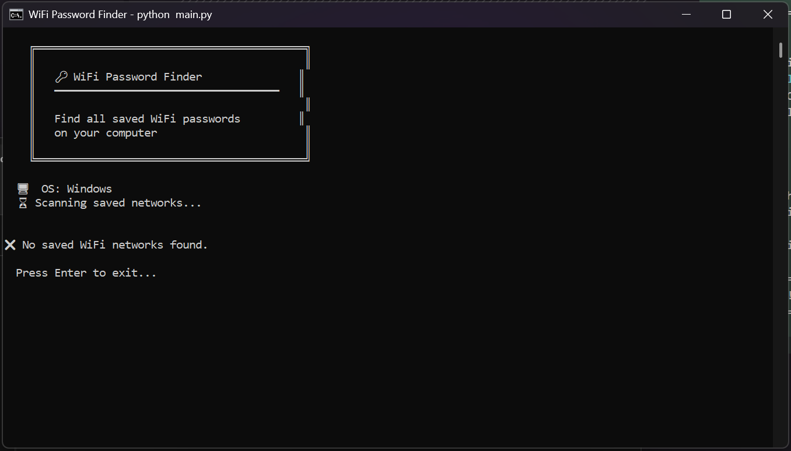

# 🔑 WiFi Password Finder

Find and display all saved WiFi passwords on your computer. Supports Windows, Linux, and macOS. No external dependencies — uses only built-in OS commands.


## 📸 Screenshot

<p align="center">
  
</p>

## ✨ Features

- 🔑 **Find All Saved WiFi Passwords** — Displays every network you've connected to
- 🖥️ **Cross-Platform** — Windows, Linux, macOS
- 📁 **Export** — Save results to TXT or JSON
- 🚀 **Zero Dependencies** — No pip install needed, pure Python
- ⚡ **Instant** — Results in under 1 second
- 🔒 **Local Only** — Nothing sent to internet, runs offline

## 🚀 Quick Start

```bash
git clone https://github.com/yourusername/wifi-password-finder.git
cd wifi-password-finder
python main.py
```

**Windows:**
```
Double-click START.bat
```

> No `pip install` needed — this script uses only Python standard library!

## 📖 How It Works

| OS | Method |
|----|--------|
| Windows | `netsh wlan show profiles key=clear` |
| Linux | Reads `/etc/NetworkManager/system-connections/` or `nmcli` |
| macOS | `security find-generic-password` + `networksetup` |

## 📊 Output Example

```
══════════════════════════════════════════════════════════════════════
WiFi Network                   Password                  Security
══════════════════════════════════════════════════════════════════════
🔑 HomeNetwork                 MyP@ssw0rd123             WPA2-Personal
🔑 Office_5G                   OfficePass!456            WPA2-Personal
🔑 CoffeeShop_Free             coffee2024               WPA2-Personal
🔓 Airport_WiFi                (no password)             Open
🔑 Hotel_Room_402              room402guest              WPA2-Personal
══════════════════════════════════════════════════════════════════════

📊 Total networks: 5 | With passwords: 4
```

## 📁 Export Options

| Format | Description |
|--------|-------------|
| TXT | Human-readable text file |
| JSON | Machine-readable, importable |

## 📁 Project Structure

```
wifi-password-finder/
├── main.py         # Main script (that's it!)
├── START.bat       # Windows launcher
├── images/         # Screenshots
└── README.md
```

## 🔧 Requirements

- Python 3.7+ (no external packages)
- **Windows:** Run as normal user (no admin needed)
- **Linux:** Run with `sudo` for full access
- **macOS:** May need Keychain access permission

## ⚠️ Disclaimer

This tool only shows passwords **already saved on YOUR computer**. It does NOT hack or crack any networks. Use responsibly and only on devices you own.

## 📄 License

MIT License

## ⭐ Star This Repo

If useful, give it a ⭐!
